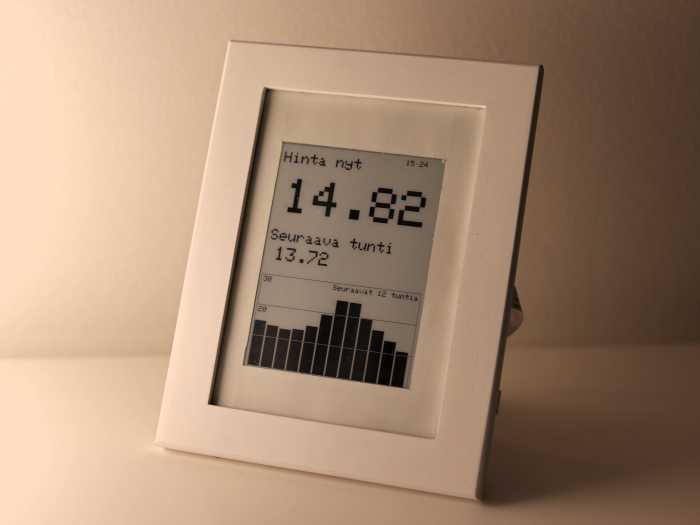
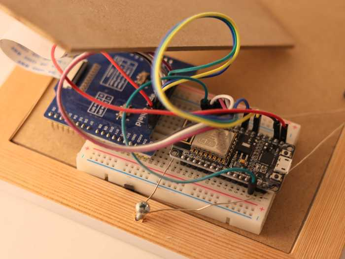

# Displaying Electricity Spot Prices on an E-Ink Display

This is a NodeMCU (ESP8266)-based project that displays electricity spot prices on an e-paper (e-ink) display. Prices are fetched from a public Finnish API that provides national electricity price data.

The current price and the next hour’s price are shown as numeric values. The prices for the next 12 hours are displayed as a bar chart.

The board wakes up once per hour to fetch new data and refresh the display. This happens a few minutes after each full hour. Between updates the board is put into deep sleep mode to save power.

The data is fetched in CSV format. I found that CSV is significantly faster to parse and uses less memory than JSON. I was not able to fetch a 12-hour time frame using JSON, but the CSV format works without issues.

## Data source

- https://sahkotin.fi

## Required components

- NodeMCU board (or similar)
- Waveshare 5.83" E-Ink Raw Display (600 × 448) or similar
- Waveshare Universal e-Paper Raw Panel Driver Shield for Arduino / NUCLEO
- Photo frame (for a clean, finished look)

## Images

The board is attached to the photo frame for the nice end result.

