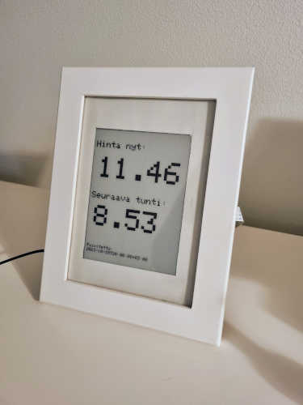
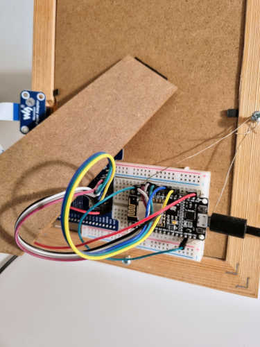

# Show electricity spot price on the e-ink display

NodeMCU (ESP8266) based project to display electricity spot price on the epaper (e-ink) display. The project is usefull when the apartment electricity contract is tied to the spot price and you want to follow the current price. The price is fetch from the Finnish public API endpoint that returns national price information. 

The board is woken up once per hour to fetch the data and refresh the display. This will happen few minutes after even hour. Meanwhile the board is put to the deepsleep mode. The required sleep time is calculated by the current time.

The Wifi secrets are kept in the separate file `arduino_secrets.h` that is not part of this repo.

## Data endpoints:
- https://spot-hinta.fi/
- https://api.spot-hinta.fi/swagger/ui#/

## Required components
- NodeMCU board (or similar)
- Epaper Waveshare 5.83" E-INK RAW DISPLAY 600X448 (or similar)
- Waveshare Universal e-Paper Raw Panel Driver Shield for Arduino / NUCLEO
- Photo frame for the solid endresult

## Images
I fit the e-ink display to the photo frame.

